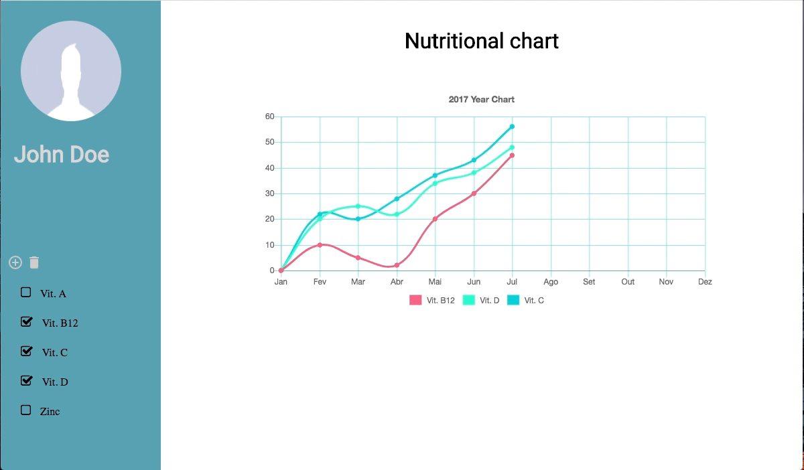

# Nutritional chart

An example of nutritional chart used to monitor the nutritional evelução patients, accompanied by a nutrition professional.

[Demo](https://mariorodeghiero.com/chart-js/) - Gitpages demo




## Getting Started

These instructions will get you a copy of the project up and running on your local machine for development and testing purposes. See deployment for notes on how to deploy the project on a live system.

### Prerequisites

What things you need to install the software and how to install them

* node.js
* NPM Package Manager

#
### Deployment Mode Features:
 - After tasks finishes, will be creates a */public* directory 
 - Minified and also concatenated **css** and **js** files setted at ```<-- build-->``` inside index.html
 - Hint for SASS and CSS compilation
 - Hint for JS files (With ES6 Support)
 - AutoPrefixer for CSS files

### Installing

Clone this repository

```
git clone http://mariorodeghiero.com/chart-js/
```
Installing the dependencies from the NPM Package Manager
```
npm install
```
To start the development environment, run the following command:

```
gulp server
```
After run, the BrowserSync will open a browser window automatically at http://localhost:3000

## Deployment

Run the command below to deploy
```
gulp
```
## Built With

* [Node.JS](https://nodejs.org) - The runtime build
* [NPM](https://www.npmjs.com/) - Dependency Management
* [Bower](https://bower.io/) - Front-end Dependency Management
* [Gulp](http://gulpjs.com/) - Development Task Manager
* [Chart.js](http://www.chartjs.org/) - Simple yet flexible JavaScript charting for designers & developers


## Contributing

Please read [CONTRIBUTING.md](https://github.com/mariorodeghiero/chart-js/blob/master/CONTRIBUTRING.md) for details on our code of conduct, and the process for submitting pull requests to us.


## Authors

* [Mário Antônio A. Rodeghiero](https://github.com/mariorodeghiero)


## License

This project is licensed under the MIT License - see the [LICENSE.md](LICENSE.md) file for details

